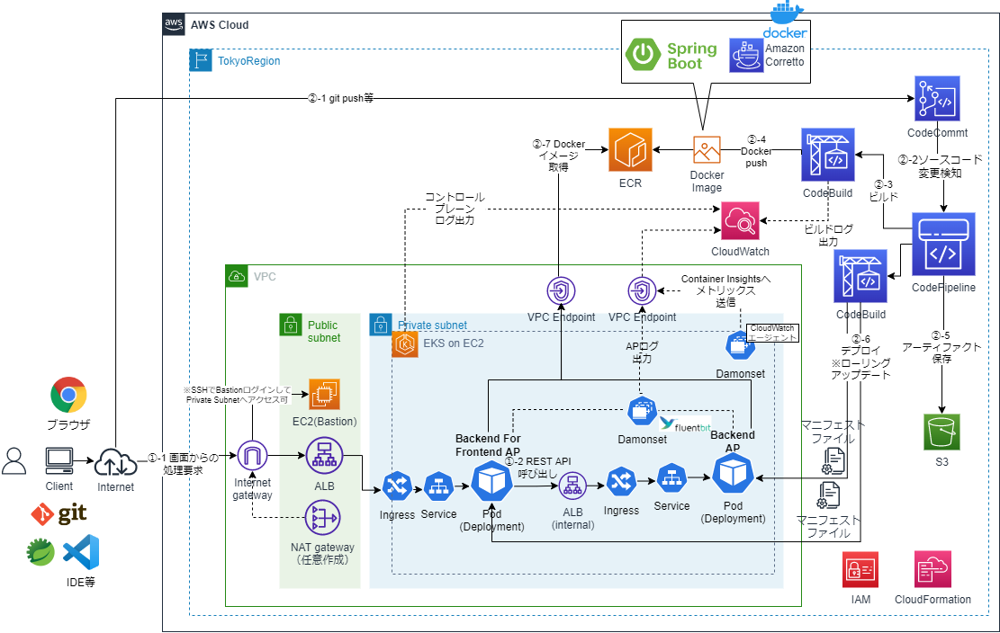

# SpringBoot APをEKS on EC2で動作させCode系でCI/CDするCloudFormationサンプルテンプレート
## 構成
* システム構成図


## CI環境
* 別途、以下の2つのSpringBootAPのプロジェクトが以下のリポジトリ名でCodeCommitにある前提
  * backend-for-frontend
    * BFFのAP
  * backend
    * BackendのAP
  * TBD
    * マニフェストファイル用のリポジトリ
### 1. ECRの作成
```sh
aws cloudformation validate-template --template-body file://cfn-ecr.yaml
aws cloudformation create-stack --stack-name ECR-Stack --template-body file://cfn-ecr.yaml
```

### 2. CodeBuildのプロジェクト作成
```sh
aws cloudformation validate-template --template-body file://cfn-bff-codebuild.yaml
aws cloudformation create-stack --stack-name BFF-CodeBuild-Stack --template-body file://cfn-bff-codebuild.yaml --capabilities CAPABILITY_IAM
aws cloudformation validate-template --template-body file://cfn-backend-codebuild.yaml
aws cloudformation create-stack --stack-name Backend-CodeBuild-Stack --template-body file://cfn-backend-codebuild.yaml --capabilities CAPABILITY_IAM
```
* Artifact用のS3バケット名を変えるには、それぞれのcfnスタック作成時のコマンドでパラメータを指定する
    * 「--parameters ParameterKey=ArtifactS3BucketName,ParameterValue=(バケット名)」

* 本当は、CloudFormationテンプレートのCodeBuildのSorceTypeをCodePipelineにするが、いったんDockerイメージ作成して動作確認したいので、今はCodeCommitになっている。動いてはいるので保留。

### 3. ECRへ最初のDockerイメージをプッシュ
2つのCodeBuildプロジェクトが作成されるので、それぞれビルド実行し、ECRにDockerイメージをプッシュさせる

## EKS環境

### 1. VPCおよびサブネット、InternetGateway等の作成
```sh
aws cloudformation validate-template --template-body file://cfn-vpc.yaml
aws cloudformation create-stack --stack-name ECS-VPC-Stack --template-body file://cfn-vpc.yaml
```

### 2. NAT Gatewayの作成とプライベートサブネットのルートテーブル更新
```sh
aws cloudformation validate-template --template-body file://cfn-ngw.yaml
aws cloudformation create-stack --stack-name ECS-NATGW-Stack --template-body file://cfn-ngw.yaml
```

### 3. Security Groupの作成
```sh
aws cloudformation validate-template --template-body file://cfn-sg.yaml
aws cloudformation create-stack --stack-name ECS-SG-Stack --template-body file://cfn-sg.yaml
```
* 必要に応じて、端末の接続元IPアドレス等のパラメータを指定
    * 「--parameters ParameterKey=TerminalCidrIP,ParameterValue=X.X.X.X/X」

### 4. VPC Endpointの作成
```sh
aws cloudformation validate-template --template-body file://cfn-vpe.yaml
aws cloudformation create-stack --stack-name ECS-VPE-Stack --template-body file://cfn-vpe.yaml
```

### 5. IAMの作成
* TBD

### 6. ALB?の作成
* TBD

### 7. EKSクラスタの作成
* TBD

### 8. マニフェストの適用？
* TBD

### 9. APの実行確認
* TBD

## CD環境
### 1. CodePipelineの作成
* TBD

### 2. CodePipelineの確認
* TBD

### 3. ソースコードの変更
* TBD
